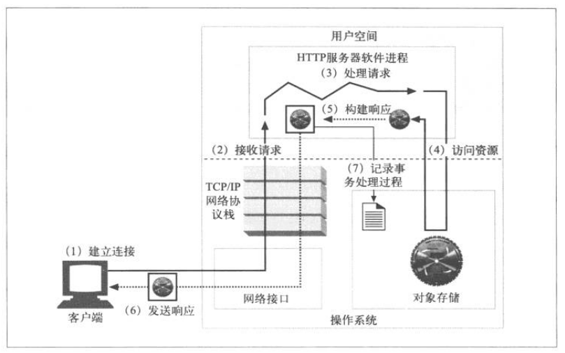

# Pink
A tiny http server

## 参考书籍

（1）Linux高性能服务器编程

（2）HTTP权威指南

## HTTP Web 服务器概念

（1）建立连接

（2）接收请求（从网络中读取HTTP请求报文）

（3）处理请求（对请求报文进行解释，并采取行动）

（4）访问资源（访问报文中指定的资源）

（5）构建响应（创建带有正确首部的HTTP响应报文）

（6）发送响应（将响应回送给客户端）

（7）记录事务处理过程（将与已完成事务有关的内容记录在一个日志文件中）

## 参数

- **Document Root**

/home/naturain/Pink_server

（注意不能让 URL 退到 docroot 之外，将文件系统暴露出来。）
