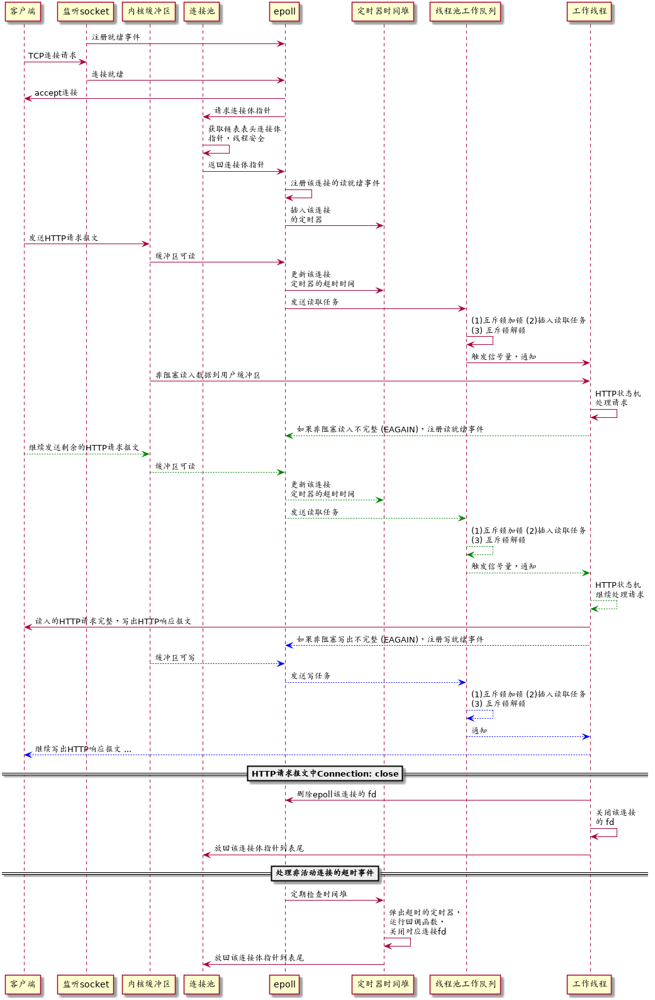

## 架构与模块

#### 整体结构与详细工作流

----

### 各大模块

#### 1. 线程池

- **结构**

1. **半同步/半反应堆模式**，工作队列(**同步**)负责任务获取与分发，工作线程(**异步**)负责处理任务。

2. 工作队列: list<pair<T*, int>>，每个任务包含结构体和一个标签 flag，用于标记 READ/WRITE 任务。

3. 工作线程: shared_ptr<pthread_t> threads，线程线程标识符数组，预分配大小。

- **优点**

1. 以空间换取时间效率。

2. 线程池适用于高并发多线程，但每个线程运行时间较短的情况。

3. 通用性高，比较 general，采用模板元编程。

- **限制**

1. 要求客户请求都是无状态的，同一个连接上的不同请求可能由不同的线程处理。

2. 容易产生惊群效应，需要特殊处理。

#### 2. Epoll 事件循环

- **结构**

1. 主线程同步运行 epoll_wait()，ET 模式。

2. 注册的事件类型: （1）新连接请求到来（2）连接socket上读就绪（3）连接socket上写就绪

3.

#### 3. HTTP连接状态机

#### 4. 时间堆
