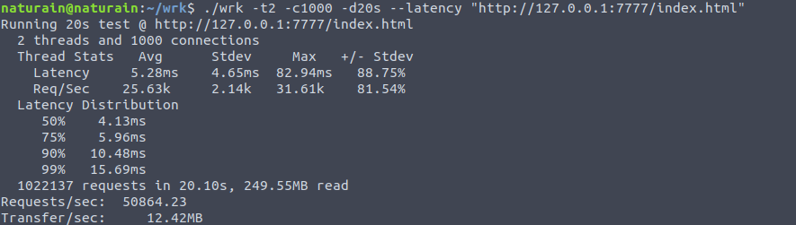
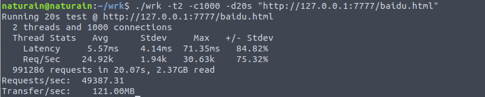
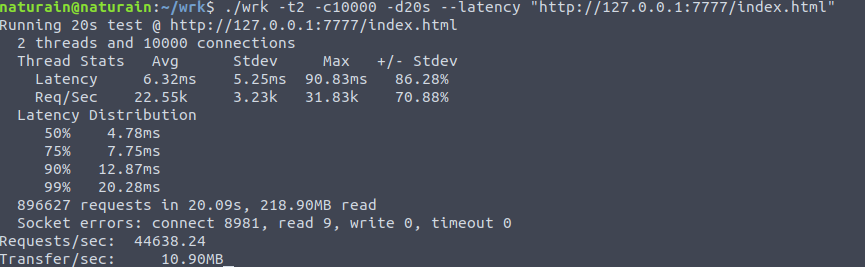
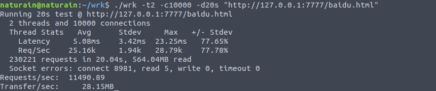
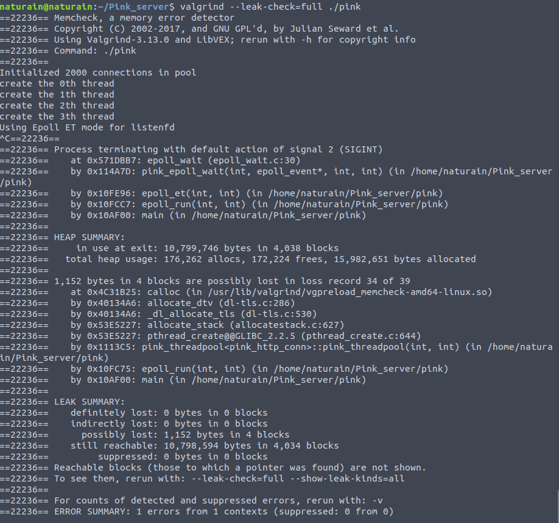
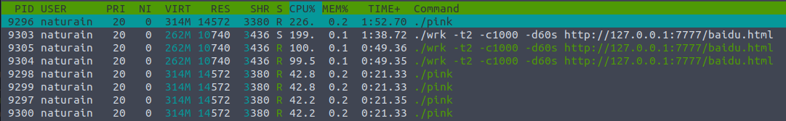

## 压力测试

- CPU: 满载3.4GHz * 8

- 压测工具1: **[webbench](http://home.tiscali.cz/~cz210552/webbench.html)**: 轻量、源码简单方便修改，**原理**: 利用 fork() 实现多进程并发访问

- 压测工具2: **[wrk](https://github.com/wg/wrk)**: 支持多线程、分析结果精细、架构卓越，**原理**: 基于 epoll (结合了redis内部的ae事件循环) + 异步非阻塞I/O + 多线程，可以极限施压

- 内存泄露检查工具: valgrind

- 测试的HTTP请求: GET

- **网页大小: index.html (172字节), baidu.html (2.5KB)**

- epoll: 监听 socket ET + 连接 socket ET

- 工作线程数: 4

---

**采用本地运行 wrk，并给它开 2 线程，测试时间 20秒。**

#### 1000个客户并发

**WRK: GET index.html ---> 约5万页面/秒， 平均延时 5.53ms**

**WRK: GET baidu.html ---> 约4.9万页面/秒， 平均延时 5.57ms**

---

#### 10K个客户并发

**此时，已经出现 socket errors，主要为 connect 错误。**

**WRK: GET index.html ---> 约2.2万页面/秒，平均延时 5.05ms**

**WRK: GET baidu.html ---> 约1.1万页面/秒，平均延时 5.08ms**

---

## 内存泄露检查

针对 10K 并发量的内存泄露检查:

（1）使用 wrk 测试完后，ctrl + c 传递给程序 SIGINT 信号，使之终止于 epoll_wait 函数。

（2）使用 pthread_create 会导致 possibly lost 问题，详情见 [stackoverflow](https://stackoverflow.com/questions/5610677/valgrind-memory-leak-errors-when-using-pthread-create)

（3）没有 definitely/indirectly lost。

（4）possibly lost 可能是通过 shell 非优雅终止程序造成的。但是操作系统会在程序终止后回收它。

Reference:

In general, there is no need to worry about "still reachable" blocks. They don't pose the sort of problem that true memory leaks can cause. For instance, there is normally no potential for heap exhaustion from "still reachable" blocks. This is because these blocks are usually one-time allocations, references to which are kept throughout the duration of the process's lifetime. While you could go through and ensure that your program frees all allocated memory, there is usually no practical benefit from doing so since the operating system will reclaim all of the process's memory after the process terminates, anyway. Contrast this with true memory leaks which, if left unfixed, could cause a process to run out of memory if left running long enough, or will simply cause a process to consume far more memory than is necessary.

## CPU Pressure

1K 并发，wrk 双线程，Pink 4 工作线程

