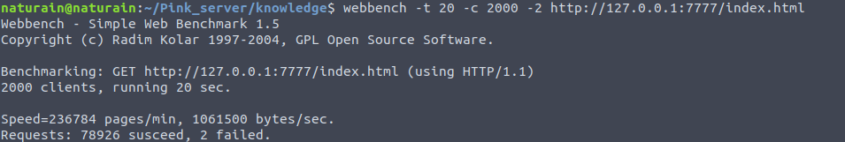
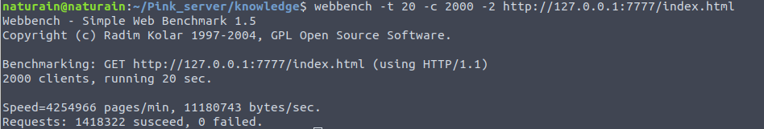

## 压力测试

CPU: 满载3.4GHz * 8

#### 监听 socket ET 模式 + 连接 socket ET 模式
**4 线程 + 1000个客户并发，测试时间: 20秒 ---> 约1640万字节/秒，0失败**

**4 线程 + 2000个客户并发，测试时间: 20秒 ---> 约106万字节/秒，2失败**

---

#### 监听 socket LT 模式 + 连接 socket ET 模式
**4 线程 + 1000个客户并发，测试时间: 20秒 ---> 约1510万字节/秒，0失败**

**4 线程 + 2000个客户并发，测试时间: 20秒 ---> 约111万字节/秒，0失败**

