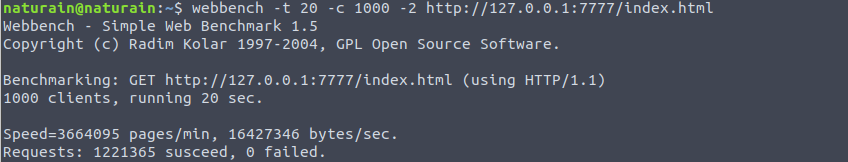
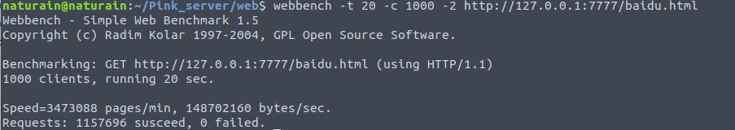
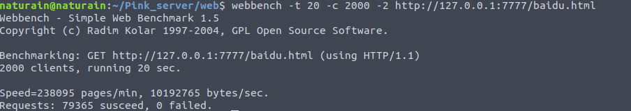
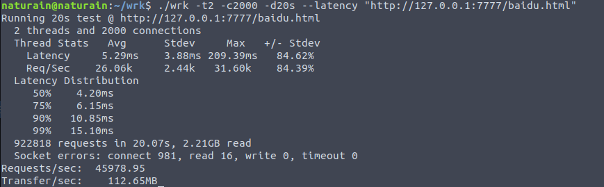

## 压力测试

- CPU: 满载3.4GHz * 8

- 测试工具1: **[webbench](http://home.tiscali.cz/~cz210552/webbench.html)**: 轻量、源码简单方便修改，**原理**: 利用 fork() 实现多进程并发访问

- 测试工具2: **[wrk](https://github.com/wg/wrk)**: 支持多线程、分析结果精细、架构卓越，**原理**: 基于 epoll (结合了redis内部的ae事件循环) + 异步非阻塞I/O + 多线程，可以极限施压

- 测试的HTTP请求: GET

- **网页大小: index.html (172字节), baidu.html (2.5KB)**

- epoll: 监听 socket ET + 连接 socket ET

- 工作线程数: 4

---
#### 1000个客户并发

**Webbench: GET index.html  ---> 366万页面/分钟，1642万字节/秒，0失败**

**Webbench: GET baidu.html --- 347万页面/分钟，1.48亿字节/秒，0失败**

**WRK: GET baidu.html ---> 5.2万页面/秒， 平均延时 5.12ms**

---

#### 2000个客户并发

**Webbench: GET index.html ---> 23万页面/分钟，106万字节/秒，2失败**

**Webbench: GET baidu.html ---> 23万页面/分钟，1019万字节/秒，0失败**

**WRK: GET baidu.html ---> 4.6万页面/秒，平均延时 5.29ms**

---

#### 10K个客户并发

**WRK: GET baidu.html ---> 4.8万页面/秒，平均延时 5.21ms**

---
1. 可以看到随着并发量的提高，每分钟响应的页面明显减少，说明线程切换
