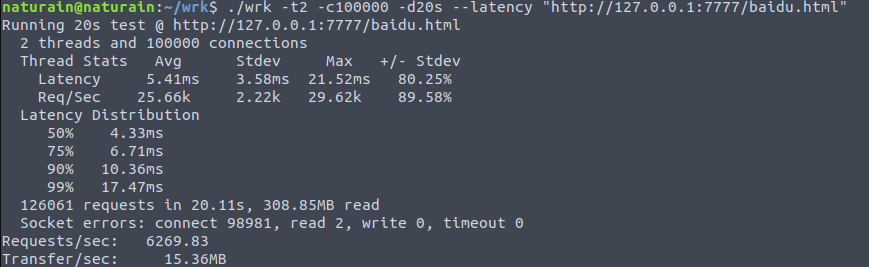

## 压力测试

- CPU: 满载3.4GHz * 8

- 测试工具1: **[webbench](http://home.tiscali.cz/~cz210552/webbench.html)**: 轻量、源码简单方便修改，**原理**: 利用 fork() 实现多进程并发访问

- 测试工具2: **[wrk](https://github.com/wg/wrk)**: 支持多线程、分析结果精细、架构卓越，**原理**: 基于 epoll (结合了redis内部的ae事件循环) + 异步非阻塞I/O + 多线程，可以极限施压

- 测试的HTTP请求: GET

- **网页大小: index.html (172字节), baidu.html (2.5KB)**

- epoll: 监听 socket ET + 连接 socket ET

- 工作线程数: 4

---
#### 1000个客户并发

采用本地运行 wrk，并给它开 2 线程，测试时间 20秒。

**WRK: GET index.html ---> 约5.1万页面/秒， 平均延时 5.28ms**

**WRK: GET baidu.html ---> 约4.7万页面/秒， 平均延时 5.77ms**

---

#### 10K个客户并发

采用本地运行 wrk，并给它开 2 线程，测试时间 20秒。

**WRK: GET index.html ---> 约4.5万页面/秒，平均延时 6.32ms**

**WRK: GET baidu.html ---> 约4.8万页面/秒，平均延时 5.73ms**

---

#### 100K个客户并发

采用本地运行 wrk，并给它开 2 线程，测试时间 20秒。

**WRK: GET baidu.html ---> 约0.63万页面/秒，平均延时 5.41ms**

---
